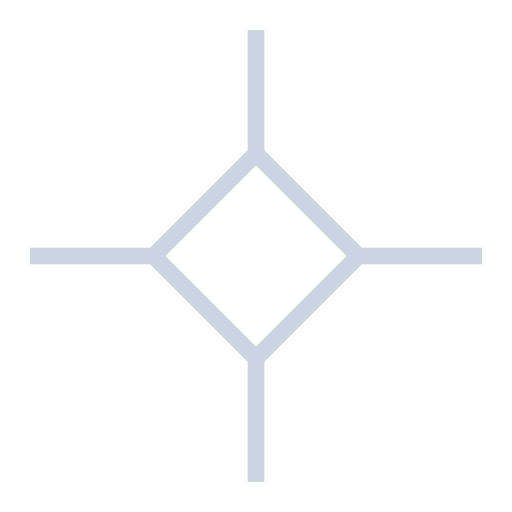

# Verifiers Toolkit

  

  From Circom and Noir circuits to Cairo verifiers on Starknet — powered by <a href="https://github.com/keep-starknet-strange/garaga">Garaga</a>.

  <strong>Live site:</strong> <a href="https://verifierstoolkit.xyz">verifierstoolkit.xyz</a>

---

## What it does

The toolkit covers three workflows, each producing a deployed Cairo verifier on Starknet.

### 1. Circuit → Verifier

Write a Circom or Noir circuit and the toolkit handles every step end-to-end:

| Step | Circom (Groth16) | Noir (UltraHonk) |
|------|-----------------|-----------------|
| Compile | `.circom` → R1CS | `.nr` → ACIR |
| Setup | Trusted setup via SnarkJS + PTAU | Proving key via Barretenberg |
| Prove | Generate proof + public inputs | Generate proof + public inputs |
| Generate verifier | Groth16 Cairo verifier via Garaga | UltraHonk Cairo verifier via Garaga |
| Compile verifier | Scarb | Scarb |
| Deploy | Starknet (Sepolia / Mainnet) | Starknet (Sepolia / Mainnet) |
| Verify on-chain | Verification key + proof + public inputs → calldata generated off-chain via Garaga → on-chain call (BN254 or BLS12-381) | Verification key + proof + public inputs → calldata generated off-chain via Garaga → on-chain call |

### 2. Verification Key → Verifier

Already have a verification key? Skip the circuit and proving steps entirely. Upload a `verification_key.json` (Groth16) or the equivalent UltraHonk VK, and the toolkit generates, compiles, and deploys a Cairo verifier contract directly from it.

### 3. Verify a Proof

Already deployed a verifier and have a verification key, proof, and public inputs? Submit them together — calldata is generated off-chain via Garaga and the transaction is sent to your deployed verifier contract for on-chain verification.

---

## Supported proof systems

| Proof system | Circuit language | Backend |
|-------------|-----------------|---------|
| Groth16 | Circom | SnarkJS |
| UltraHonk | Noir | Barretenberg (bb) |

---

## Tech stack

- [Next.js](https://nextjs.org) — frontend and API routes
- [@distributedlab/circom2](https://www.npmjs.com/package/@distributedlab/circom2) — Circom 2 compiler
- [SnarkJS](https://github.com/iden3/snarkjs) — Groth16 proving backend
- [Noir / Barretenberg](https://noir-lang.org) — UltraHonk proving backend
- [Garaga](https://github.com/keep-starknet-strange/garaga) — Cairo verifier generation and calldata encoding
- [starknet-kit](https://www.starknetkit.com) — Starknet utilities
- [Starknet.js](https://www.starknetjs.com) — wallet connection and on-chain deployment
